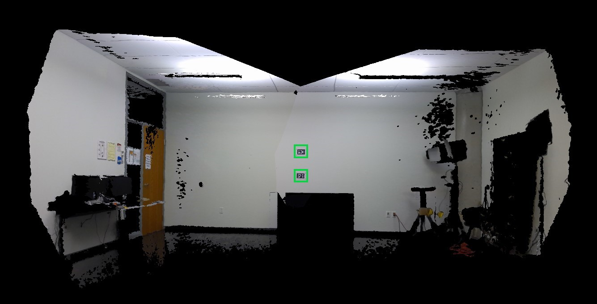
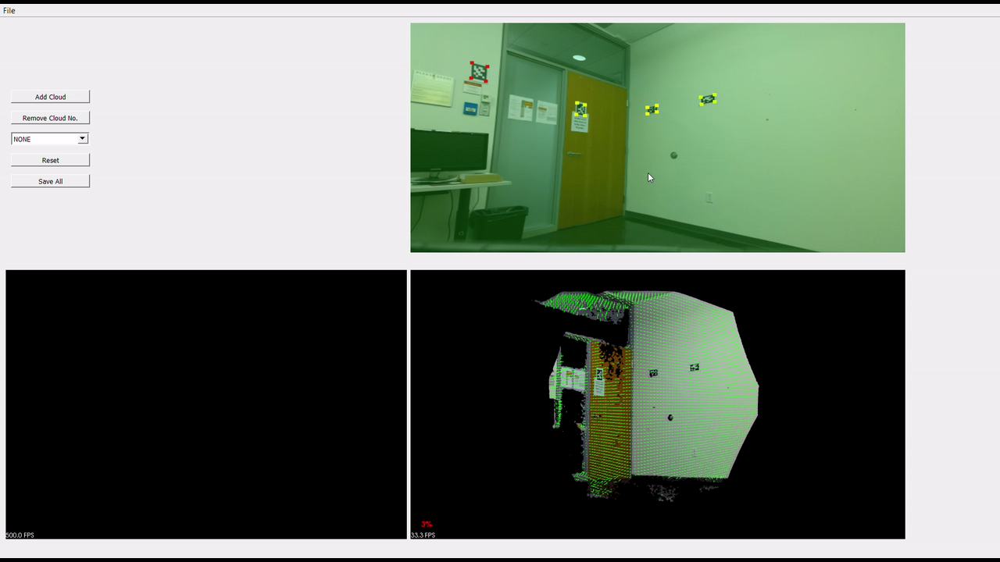

# LiveAlignment
A C++ application for 3D reconstruction of indoor scenes using fiducials. The application is interactive and online. While creating the 3D model, user can use the GUI provided to choose the camera poses. The GUI helps user choosing apropriate frames better for 3D reconstruction.  

# Demo

 

## Technical Details
### Supported OS
Windows 10

### Libraries and Tools Used
Azure Kinect SDK  
PCL 1.10  
QT 5.13  
OpenCV 4.11  
VTK 8.2  
CMake 3.16  
Visual Studio 2019  

## Installation
Please first install Qt and then install VTK with Qt from source. Generate QVTKWidgetPlugins and copy them to qt designer folder. Afterwards, build PCL from source. Download Azure Kinect SDK, rename it as 'AzureKinect' and keep it in the 'lib' folder. Finally use cmake to generate build files.